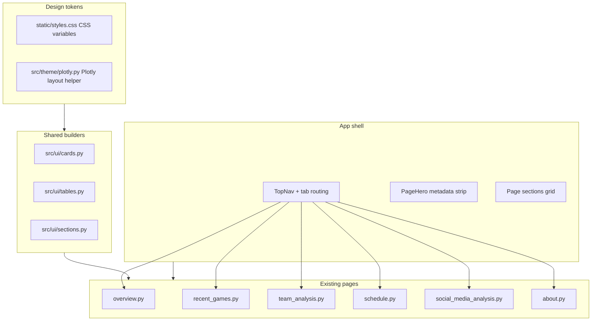

# Full frontend redesign plan (Dash)

## Context and constraints

- **Stack**: Dash 2.x, `dash-bootstrap-components` with [`dbc.themes.SLATE`](../src/server.py), Plotly figures, `dash_table.DataTable`, global CSS in [`../static/styles.css`](../static/styles.css). Runtime is `python -m src.server` per [`../docker/Dockerfile`](../docker/Dockerfile).
- **Data boundary**: Keep [`../src/database.py`](../src/database.py), [`../src/data.py`](../src/data.py), and all `src/data_cols/*` column definitions and transforms unchanged. Redesign touches **layouts**, **styling**, and **Plotly `update_layout` / traces**—not SQL or DataFrame shapes. **Exception (display only)**: the app shell may **read** the already-loaded `feature_flags_df` to render season/playoff banner text (no new tables or queries).
- **Design reference**: Use your **teal / cyan + muted blue (comparison) + coral/red (negative)** palette and typography hierarchy (serif display for hero titles, sans for UI/data) inspired by the mockups. Treat the mockups’ **layout patterns** (top app bar, hero row, KPI cards, chart + table pairs, pills/badges) as the target UX; **ignore** any conflicting colors from the Claude exports.

## Locked decisions (grill-me / plan review)

- **Navigation**: Use **styled `dbc.Tabs` only** (plan Phase 2 option A). **Dash multipage / URL-per-tab is out of scope** for this redesign given closed product scope and no planned new features.
- **Global search**: **Omit** the search bar and ⌘K behavior from the shell for this version.
- **Typography**: Load **display serif + UI sans from Google Fonts** (or similar CDN) via `app.index_string` / layout link.
- **Shell season / phase copy**: Drive the season vs playoffs (and related) banner from the existing **`feature_flags` → `feature_flags_df`** loaded in [`../src/database.py`](../src/database.py) (`flag` / `is_enabled` rows; exact flag names must match your deployed table). **No LIVE pill in v1** — omit that control entirely.
- **Tab badges**: Show **counts on tabs** (e.g. Recent Games, Schedule) when values are **cheap to derive at import time** from existing DataFrames (no extra queries).
- **Plotly hovers (locked)**: Standardize on **dark hoverlabels** (charcoal background, light text) via the shared theme helper for all figures.
- **Integration test database (locked)**: use **Testcontainers for Python** to run Postgres for integration tests and CI, **replacing** the compose-orchestrated test Postgres pattern in [`../docker/docker-compose-test.yml`](../docker/docker-compose-test.yml); keep [`../docker/docker-compose-local.yml`](../docker/docker-compose-local.yml) for interactive dev unless you decide otherwise.

## Python style (implementation)

- **No module-level “Phase N …” docstrings** (or similar milestone banners) at the top of Python files. Use normal code structure; document behavior inline only where it prevents real confusion, not to track redesign phases in source headers.

## Current pain points (what we are fixing)

- **Duplication**: `COMMON_HOVER_STYLE`, KPI helpers, and table `style_cell` blocks are repeated across [`../src/pages/overview.py`](../src/pages/overview.py), [`../src/pages/recent_games.py`](../src/pages/recent_games.py), [`../src/pages/team_analysis.py`](../src/pages/team_analysis.py) (e.g. a second `create_kpi_card` there), etc.
- **Split theming**: [`../src/config.py`](../src/config.py) defines `DARK_LAYOUT_TEMPLATE` and `CUSTOM_COLORS`, but many pages still hardcode Gill Sans, `#383b3d`, purple MVP colors, etc.
- **Shell**: [`../src/server.py`](../src/server.py) uses default `dbc.Tabs` only; there is an unused `html.Div(id="tab-content")` with **no callbacks**—safe to remove or repurpose when introducing a real shell.
- **Small bug to fix during pass**: [`../src/pages/about.py`](../src/pages/about.py) links `href="../assets/styles.css"` while the app serves assets from [`../static/`](../static/styles.css) via `assets_folder="../static"` in `server.py`—the redesign should use one consistent asset story (prefer `static/` + optional `assets/` for fonts).

## Target architecture

## Phase 1 — Design tokens and global CSS

- Add a **token layer** at the top of [`../static/styles.css`](../static/styles.css). For the current stylesheet size, **prefer one file** with a clearly delimited token block; split into `static/tokens.css` only if maintainability suffers as overrides grow.
- Map Bootstrap/DBC overrides to tokens (body, `.nav-tabs`, cards, dropdowns, inputs) so SLATE remains the mechanical base but **visual ownership** moves to your palette.
- Normalize typography: load **one serif + one sans from Google Fonts** (via `app.index_string` or a small link in layout head; **locked**) and set `body` / `h1`–`h6` / optional monospace for numeric tables if desired.
- Reconcile **DataTable** rules: today global `.dash-spreadsheet` rules in CSS interact with page-specific `style_*`; keep a single **table skin** in CSS plus thin per-table exceptions only where conditional formatting must win (see comment in CSS about schedule conditional formatting—preserve behavior).

## Phase 2 — App shell (navigation and page frame)

- Replace “tabs only” with a **composed shell** in [`../src/server.py`](../src/server.py): `dbc.Container` / fluid grid, top row with brand (**NBA Dashboard**), centered **restyled `dbc.Tabs`** (underline active state, optional count badges via `label` + `dbc.Badge` where counts are cheap at import time), right cluster (**no global search**, **no LIVE pill**). **Season / playoffs (or equivalent) label** from **`feature_flags_df`** at layout build time (import from `src.database`); map `flag` / `is_enabled` to the string shown in the shell (align flag names with production `feature_flags` contents).
- **Tab behavior (locked)**: **Option A** — keep `dbc.Tabs`, heavy custom CSS/classes. **Multipage URLs are explicitly out of scope** for this pass.
- Remove the dead `html.Div(id="tab-content")` unless repurposed; with multipage out of scope, **delete** it.

## Phase 3 — Shared Python UI module (`src/ui/`)

Introduce small, focused modules (names illustrative):

| Module                | Responsibility                                                                                                                                                                                                                                |
| --------------------- | --------------------------------------------------------------------------------------------------------------------------------------------------------------------------------------------------------------------------------------------- |
| `src/theme/plotly.py` | `plotly_theme()`, `apply_dark_layout(fig)`, semantic trace colors (primary line, secondary dashed, win/loss diverging).                                                                                                                       |
| `src/ui/sections.py`  | `page_hero(kicker, title, subtitle, meta_columns)`, `section_header(title, aside)`, responsive `dbc.Row`/`Col` grids.                                                                                                                         |
| `src/ui/cards.py`     | `stat_card(title, value, delta=None, footer=None)` replacing ad-hoc `create_kpi_card` usage; unify with [`../src/config.py`](../src/config.py) (either move `create_kpi_card` here and re-export, or delete duplicate in `team_analysis.py`). |
| `src/ui/tables.py`    | `dark_datatable(**kwargs)` merging default `style_cell`, `css`, tooltip styling so pages only pass `columns`, `data`, `id`, and conditional styles.                                                                                           |
| `src/ui/badges.py`    | Team abbreviation pill, delta pill, sentiment pill—HTML `Span`/`dbc.Badge` builders matching mockups.                                                                                                                                         |

**Rule**: Pages should mostly **assemble** builders + data; long inline `style={...}` blocks should shrink over time.

## Phase 4 — Color and chart migration (Plotly)

- Centralize figure styling: start from [`DARK_LAYOUT_TEMPLATE`](../src/config.py) and extend with token-matched hex values from `plotly.py` so every figure gets consistent `paper_bgcolor`, `plot_bgcolor`, gridlines, axis fonts, and **legend** placement.
- Replace legacy accents:
  - **Primary highlights / wins / positive**: teal/cyan family (replaces much of the current `#3fb7d9` / `#1eaedb` usage where it reads as “brand” rather than “10+ above avg”).
  - **MVP / season-high tier (locked)**: use a **distinct second hue** (e.g. amber or violet), not the same teal as brand primary, so legends stay distinguishable from teal “good” series and from muted-blue comparisons.
  - **Negative / losses**: keep a controlled red/coral (`--danger`).
  - **Comparison series** (e.g. last season): muted blue, dashed—aligned with your second reference image.
- Consolidate duplicated `COMMON_HOVER_STYLE` dicts into one exported constant from `src/theme/plotly.py` (or `src/ui/hover.py`) using the **dark hover** convention (locked).

## Phase 5 — Page-by-page UI pass (layout only)

Apply the shell + sections + cards + themed figures in this order (dependencies and reuse):

1. **[`../src/server.py`](../src/server.py)** — global shell, fonts, meta.
2. **[`../src/pages/overview.py`](../src/pages/overview.py)** — hero + KPI row + standings tables + scatter/line charts; align with “league at a glance” structure from mockups.
3. **[`../src/pages/recent_games.py`](../src/pages/recent_games.py)** — game picker strip as horizontal cards, PBP chart styling, legend as a proper card.
4. **[`../src/pages/team_analysis.py`](../src/pages/team_analysis.py)** — team selector + timeframe toggles (`dbc.ButtonGroup` / pills), KPI row, MOV + efficiency charts.
5. **[`../src/pages/schedule.py`](../src/pages/schedule.py)** — upcoming game cards + schedule strength chart; **retest** conditional table coloring called out in CSS comments.
6. **[`../src/pages/social_media_analysis.py`](../src/pages/social_media_analysis.py)** — KPI row + stacked sentiment bars + keywords table.
7. **[`../src/pages/about.py`](../src/pages/about.py)** — editorial hero + “built & operated” card; fix stylesheet link; surface `GIT_COMMIT` and deploy metadata similarly to mockups (values can stay truthful/minimal).

**Out of scope unless you uncomment it**: [`../src/pages/player_analysis.py`](../src/pages/player_analysis.py) (tab is commented in `server.py`).

## Phase 6 — Quality bar

- **Accessibility**: focus rings on interactive controls, sufficient contrast for teal on charcoal, keyboard operability for custom nav (especially if leaving `dbc.Tabs`).
- **Performance**: avoid duplicating huge `tooltip_data` where unnecessary; keep existing behavior unless profiling shows wins.
- **Tests**: treat testing as a **first-class deliverable** alongside UI (see **Phase 7**). Phase 6 still expects `make test` / pytest green on every merge.

## Phase 7 — Testing strategy (expanded)

Today the suite is modest: a handful of [`../tests/unit/`](../tests/unit/) cases, several [`../tests/integration/`](../tests/integration/) tests that call page callbacks and assert figure/table types and a few field values (e.g. [`../tests/integration/team_analysis_test.py`](../tests/integration/team_analysis_test.py)), plus DB/fixture tests. The redesign should **grow coverage deliberately** in layers so failures point to regressions quickly.

### Principles

- **Prefer testing pure logic** added in `src/theme/` and `src/ui/` (no Postgres, no full Dash app) — fast, stable CI.
- **Keep existing integration tests** passing; extend them where they encode valuable contracts (axis titles, column presence).
- **Separate slow layers**: mark browser / full-app tests (if added) so local `pytest -m "not e2e"` stays fast; run full suite in CI or nightly.
- **Integration database**: use **Testcontainers** for Postgres in pytest/CI instead of a **separate compose file** dedicated to the test DB (see 7c).

### 7a — Unit tests (new and expanded)

| Target | What to assert |
|--------|----------------|
| `src/theme/plotly.py` | `apply_dark_layout` / `plotly_theme` set expected `layout` keys (`paper_bgcolor`, `plot_bgcolor`, font family/color); hover template matches **dark hover** convention; optional: trace default colors are members of an allowed token set. |
| Shell helpers | Pure function e.g. `shell_banner_from_flags(feature_flags_df) -> str` (extract from `server.py` if logic grows): given small in-memory DataFrames, correct string for playoffs vs regular; unknown flags handled safely. |
| `src/ui/cards.py`, `sections.py`, `badges.py`, `tables.py` | Builders return expected Dash component types; critical `id` props stable where callbacks depend on them; `dark_datatable` merges defaults without dropping caller `style_data_conditional`. |

### 7b — Golden / snapshot tests (Plotly)

- For 1–2 **canonical figures** per major callback (or per theme application), store **approved subsets** of `fig.to_plotly_json()` under `tests/fixtures/golden/` (e.g. `layout.paper_bgcolor`, `layout.font`, first trace `line.color`, `hoverlabel`).
- On change, reviewers update goldens intentionally (same workflow as snapshot testing in other stacks). Avoid snapshotting entire large figures (noisy); snapshot **theme-relevant slices** only.

### 7c — Integration tests (extend current style)

- **Postgres via Testcontainers (locked direction)**: replace the current **compose-based** test database ([`../docker/docker-compose-test.yml`](../docker/docker-compose-test.yml) `postgres` service + `dash_app_test_runner`) with **[Testcontainers for Python](https://testcontainers-python.readthedocs.io/)** spinning a **real Postgres** image in pytest (session- or module-scoped container). Apply the same schema/bootstrap as today (e.g. execute [`../docker/postgres_bootstrap.sql`](../docker/postgres_bootstrap.sql) once after the container is ready). Tests connect to the **ephemeral host/port** the container exposes; set env / config so `sql_connection` / `generate_data` target that instance (minimal refactor: env vars for host/port/user/password/DB aligned with existing [`../tests/conftest.py`](../tests/conftest.py) expectations).
  - **Implementation sketch:** session-scoped fixture `postgres_container` using `testcontainers.postgres.PostgresContainer` (e.g. `postgres:16-alpine` to match compose), credentials/db name consistent with today’s test compose; run `postgres_bootstrap.sql` after start.
  - **Dependencies:** add `testcontainers` to the **`test`** dependency group in [`../pyproject.toml`](../pyproject.toml); document that **Docker** must be available for integration tests (same class of requirement as current `make test`).
  - **CI / local:** update [`../Makefile`](../Makefile) (`make test`) and [`../.github/workflows/ci_cd.yaml`](../.github/workflows/ci_cd.yaml) to run **`uv run pytest`…** (or the repo’s standard runner) on the runner with Docker, **without** starting a separate compose stack for Postgres. **Retire or slim** [`../docker/docker-compose-test.yml`](../docker/docker-compose-test.yml) once the Testcontainers path is stable (the `dash_app_test_runner` pattern may be replaced by running pytest directly on the host/CI VM with the project venv).
  - **Migration:** keep [`../docker/docker-compose-local.yml`](../docker/docker-compose-local.yml) for **interactive** local dev if still desired; it is orthogonal to the test DB story.
- **Parametrize** where pages expose the same pattern (e.g. every `update_*` returns a `go.Figure` with non-empty `data` for a fixed team from fixtures, where feasible).
- **DataTable contracts**: assert `columns` include required `id`s; row count bounds; for schedule, assert conditional-style rules still apply for known fixture rows (may require small **CSV fixtures** mirroring edge cases, not only live DB rows).
- **Imports**: tests that import `src.server` or build `app.layout` still pay the cost of **`database` import-time loading**; Testcontainers removes the need for a **manually started** compose Postgres but does not by itself stub `generate_data`—see 7g if you need a slimmer E2E path later.

### 7d — End-to-end (Dash Testing, optional but valuable)

**Stack:** the project already includes **`dash[testing]`** in [`../pyproject.toml`](../pyproject.toml) (test group), which provides **`dash_duo`**: a real **Chrome/Chromium** session (Selenium) driving a **live Dash app** in-process.

**What to test (keep the suite small):**

1. **App boots** — Construct the same `dash.Dash` app as production (or a thin wrapper that mounts `app.layout`), start the test server fixture, open the root URL.
2. **Shell** — Assert stable DOM text: brand (**NBA Dashboard**), each main **tab label**, and (once implemented) the **season/playoff banner** derived from flags for a known DB or fixture state.
3. **Tab switching** — Programmatically activate another tab, wait for content, assert a **tab-specific** stable selector (e.g. a known `id=` on a chart wrapper or table present only on that tab) so you prove tab wiring end-to-end, not only static HTML.
4. **Optional single callback smoke** — e.g. one `dcc.Dropdown` change on Team Analysis to prove callbacks fire in the browser (higher flake cost; add only if worth it).

**Out of scope for v1 E2E:** full visual regression (screenshots of every page), asserting Plotly canvas pixels, or duplicating every callback already covered by faster tests.

**How to run:** add `tests/e2e/`; gate with **`@pytest.mark.e2e`**. Default local/CI fast path: `pytest -m "not e2e"`. Full suite: install **Chrome** + matching driver in CI (e.g. `browser-actions/setup-chrome` or Selenium-manager); use **`pytest.importorskip`** / **`skipif`** when the driver is missing so contributors without a browser still pass the default suite.

**Why optional:** browser tests are slower and flakier than unit tests; full-app E2E still needs the app’s data layer (Postgres from **Testcontainers** aligns CI with integration tests).

### 7e — CSS and assets

- **Smoke test**: read [`../static/styles.css`](../static/styles.css) in pytest and assert required **CSS variables** exist (e.g. `--accent`, `--bg`) so token refactors cannot silently drop tokens.
- Optional later: **Playwright** visual regression on 1–2 viewports (high maintenance; only if you want pixel-level guardrails).

### 7f — Coverage and CI

- Add **`pytest-cov`** reporting in CI (already in dependencies) with a **minimum line threshold** for new packages first (`src/theme`, `src/ui`), then raise globally as coverage improves.
- Track coverage in [`../.github/workflows/ci_cd.yaml`](../.github/workflows/ci_cd.yaml) (fail PR if below threshold or if coverage drops sharply).

### 7g — Fixtures and isolation (follow-ups if needed)

- Add `tests/fixtures/feature_flags_minimal.csv` (or build DataFrames in code) for shell/banner **unit** tests without DB.
- With **Testcontainers**, integration tests no longer depend on a **pre-started** compose Postgres; if full-app E2E is still heavy, document **`ENV_TYPE`** / container wiring or introduce a **`TESTING=1`** path that stubs `generate_data` (larger refactor — only if E2E becomes mandatory).

## Phase 8 — Ruff, Ty, pre-commit, and CI quality gates

Static quality tooling runs **after** (or in parallel with) the UI/test work so failures are actionable and the baseline is stable.

### 8a — `pyproject.toml` (done)

- **`ruff`**: **`dev`** group pins **`ruff>=0.14.1`** (aligned with [`.pre-commit-config.yaml`](../.pre-commit-config.yaml)); `[tool.ruff]` remains minimal (`line-length`); broader `extend-select` is optional follow-up.
- **`ty`**: in **`dev`** with **`[tool.ty.src]`** `include = ["src/theme", "src/ui"]` for incremental typing.

### 8b — Pre-commit (done)

- [`.pre-commit-config.yaml`](../.pre-commit-config.yaml): **`ruff-check`** + **`ruff-format`** @ **`v0.14.1`**, **`pyupgrade`**, **`ty`** via **`language: system`** + **`uv run ty check`** (uses project venv + third-party stubs), **`end-of-file-fixer`**, **`trailing-whitespace`**. **`pre-commit`** is a **`dev`** dependency; run **`uv run pre-commit install`** once per clone.

### 8c — CI: dedicated quality workflow

- **Implemented:** [`.github/workflows/python-quality.yml`](../.github/workflows/python-quality.yml) on **`push`** / **`pull_request`** to **`master`**, with **`paths`** filters on `src/**/*.py`, `tests/**/*.py`, `pyproject.toml`, `uv.lock`, and the workflow file.
- Single **`quality`** job: **`uv sync --locked --all-groups`**, then **`uv run ruff check src tests`**, **`uv run ruff format --check src tests`**, **`uv run ty check --output-format github`**. **Python 3.14** and **uv 0.11.14** match [`../pyproject.toml`](../pyproject.toml) and [`../docker/Dockerfile`](../docker/Dockerfile); Ruff and ty versions resolve from **`uv.lock`**.
- **[`tool.ty.src`](../pyproject.toml)** currently includes only **`src/theme`** and **`src/ui`** so **`ty`** stays green while `database` globals and Dash stubs are improved elsewhere (see Risk register).
- **[`ci_cd.yaml`](../.github/workflows/ci_cd.yaml)** runs **pytest** on PRs and on pushes to **`main`**, and **deploy** only on pushes to **`main`** after tests pass; **quality** stays in a separate workflow (and optional README badge).

- **Note:** a multi-job template with **`astral-sh/ruff-action`** and branch **`main`** was superseded by **`master`**, **`actions/checkout@v4`**, and **`uv run ruff`** for one lockfile-driven toolchain. **`dorny/paths-filter`** / **`matrix.service`** remain unnecessary for this single-package repo.

## Risk register

- **Schedule conditional formatting**: global CSS vs `style_data_conditional` ordering—migrate incrementally and verify visually.
- **Dash major version**: project pins Dash `<3`; stay within 2.x APIs unless you consciously plan an upgrade.
- **Global search / ⌘K**: **removed from scope** for this redesign (see Locked decisions).
- **E2E in CI**: browser tests need a maintained driver image and may flake; keep the suite **small** and mark slow tests clearly.
- **Import-time DB**: `src.database` loads all tables at import; E2E and layout import tests still need that data path—**Testcontainers** supplies Postgres without a separate compose test DB, but does not remove import-time coupling by itself (see 7g).
- **Testcontainers / Docker**: integration tests assume a Docker daemon (GitHub-hosted runners OK); **rootless** or exotic setups may need extra config; first container start can be slow—use **session scope** and reuse one Postgres per pytest session where safe.
- **`ty` baseline**: enabling `ty` repo-wide surfaces a large backlog (dynamic `database` globals, Dash stubs); **`[tool.ty.src]`** currently limits checks to **`src/theme`** and **`src/ui`**—expand deliberately (see Phase 8c).

## Implementation checklist

Work through Phases 1–8 in order; optionally split into page-sized PRs for review.

- [x] **tokens-css**: Add CSS variables + global typography; map DBC/DataTable/dropdown rules to tokens in `static/styles.css` (optionally split `tokens.css`).
- [x] **shell-nav**: Redesign `src/server.py` layout: top shell, styled `dbc.Tabs` (no multipage), remove dead `tab-content`, no global search; fix About stylesheet path.
- [x] **src-ui**: Create `src/ui/*` and `src/theme/plotly.py`; centralize hover + datatable + card builders; dedupe `team_analysis` `create_kpi_card`. (`src/yaml_config.py` + `src/db_connection.py` split out of [`../src/database.py`](../src/database.py) so [`../tests/conftest.py`](../tests/conftest.py) does not import the full DB module at collection time; pages still import data from `database`.)
- [x] **tests-unit-theme-ui**: Unit tests for `src/theme/plotly.py`, shell helpers, `src/ui/cards`, and `src/yaml_config` (Phase 7a; extend for `sections` / `tables` as they gain logic).
- [x] **migrate-pages**: Pages use **`page_hero`**, **`section_header`**, **`dark_datatable`**, **`apply_dark_layout`**, and **`src.ui.cards`** KPI helpers; **`create_kpi_card`** remains re-exported from [`../src/config.py`](../src/config.py) for compatibility.
- [x] **tests-golden-plotly**: Layout contract test in [`../tests/unit/test_theme_plotly.py`](../tests/unit/test_theme_plotly.py) (`test_apply_dark_layout_plotly_json_contract`).
- [x] **tests-integration-extend**: Parametrized schedule DataTable contract in [`../tests/integration/schedule_test.py`](../tests/integration/schedule_test.py).
- [x] **tests-e2e-optional**: [`../tests/e2e/README.md`](../tests/e2e/README.md) + gated placeholder in [`../tests/e2e/test_placeholder.py`](../tests/e2e/test_placeholder.py) (`RUN_E2E=1`).
- [x] **tests-css-smoke**: [`../tests/unit/test_css_tokens_smoke.py`](../tests/unit/test_css_tokens_smoke.py) asserts core CSS variables and shell hooks exist.
- [x] **ci-coverage-threshold**: Second gate in [`../.github/workflows/ci_cd.yaml`](../.github/workflows/ci_cd.yaml) for **`src.theme`** + **`src.ui`** (`THEME_UI_COVERAGE_THRESHOLD`, default 90%).
- [x] **qa-visual**: Manual sign-off (schedule conditional colors, tab rail); no automated substitute in-repo.
- [x] **tooling-pre-commit**: [`.pre-commit-config.yaml`](../.pre-commit-config.yaml) — **ruff-check** / **ruff-format** @ **v0.14.1**, **pyupgrade**, **`uv run ty check`**, **end-of-file-fixer**, **trailing-whitespace**.
- [x] **tests-testcontainers**: Testcontainers Postgres in `tests/conftest.py` + `tests/postgres_bootstrap.py`; `docker/docker-compose-test.yml` removed; `testcontainers` + `sqlparse` in test deps; `make test` / CI use `uv run pytest`.
- [x] **tooling-ruff-ty-pyproject**: **`ty`** in **[`dev`](../pyproject.toml)** dependency group; **`[tool.ty.src]`** scopes **`ty`** to **`src/theme`** and **`src/ui`**; **`ruff>=0.14.1`** in dev to align with pre-commit.
- [x] **ci-quality-workflow**: [`.github/workflows/python-quality.yml`](../.github/workflows/python-quality.yml) — **`uv run`** Ruff + **`ty`** on PR/push to **`master`** (Phase 8c).
